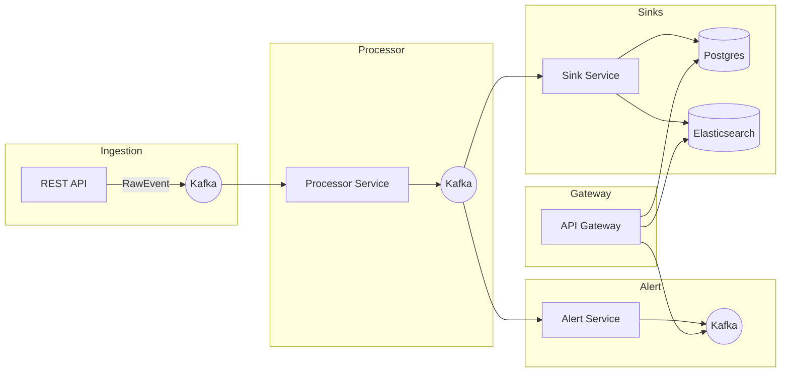

# 2) System Architecture

## 🏗 High-Level Design
- Event-driven microservices.
- Services communicate asynchronously via Kafka topics.
- Persistence handled by PostgreSQL and Elasticsearch.

---

## 🔧 Services Overview
- **Ingestion Service:** REST API → produces raw events into Kafka.
- **Processor Service:** Consumes raw events → applies transformations → publishes processed events.
- **Alert Service:** Consumes processed events → applies rules → triggers alerts/notifications.
- **Sink Service:** Persists processed events to PostgreSQL and Elasticsearch.
- **Gateway:** Provides REST API to query events, alerts, and metrics.

---

## 📊 Architecture Diagram

